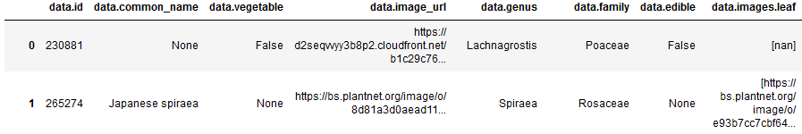

# Projet Formation Continue : Upskilling APIs

## Mise en situation :
- **But :** Parfaire mes connaissances en terme d'utilisation d'API. 

## Réalisations :
- **Librairies principales :** requests, json, 
   
- **API N°1 : Les Plantes**
	- **API :** [Les Plantes](https://trefle.io/)
      	- **Particularité :** Token + temps entre les requétes.
      	- **Résulats :** 
      	- **Suite :** Ces données peuvent être utilisées pour réaliser des applications de recherches de noms de plantes. Ou tout simplement pour réaliser un dashboard avec des KPIs.
          
