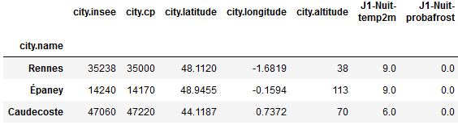

# Projet Formation Continue : Upskilling APIs

## Mise en situation :
- **But :** Parfaire mes connaissances en terme d'utilisation d'APIs gratuites sur Python et PowerBi + création d'une API en Fast API. 

## Réalisations :
- **Librairies principales :** requests, json, geopandas, folium, geoviews
   
- **API N°1 : Les Plantes**
	- **API :** [Les Plantes](https://trefle.io/)
      	- **Particularité :** Token + temps entre les requétes.
      	- **Résulats :** 
      	- **Suite :** Ces données peuvent être utilisées pour réaliser des applications de recherches de noms de plantes. Ou tout simplement pour réaliser un dashboard avec des KPIs.
  
- **API N°2 : La météo**
	- **API :** [La météo](https://api.meteo-concept.com/)
      	- **Particularité :** Token.
      	- **Résulats :** 
      	- **Suite :** Ces données peuvent être utilisées pour réaliser des applications de recherches de prévision météorologique. Ou tout simplement pour réaliser un dashboard avec des KPIs.
  
- **API N°3 : Montpellier**
	- **API :** [Montpellier](https://portail-api.montpellier3m.fr/)
      	- **Particularité :** Plusieurs possibilités d'extraction de données.
      	- **Résulats :** 
      	- **Suite :** Ces données peuvent être utilisées pour réaliser des applications de vérification d'emplacement libre des vélos et des vélos disponibles.
  
- **API N°4 : Professionnels du Bio**
	- **API :** [Les Professionnels du Bio](https://api.gouv.fr/documentation/api-professionnels-bio)
      	- **Particularité :** Extraction par département pour avoir toutes les données.
      	- **Résulats :** 
      	- **Suite :** Ces données peuvent être utilisées pour créer des cartes, des graphiques, des applications ou pour ajouter des données à un modèle de ML.
  
- **API N°5 : Création d'une API sur les Champignons**
	- **Données :** [Les Champignons](https://www.data.gouv.fr/fr/datasets/r/e5ba031c-ae1c-476a-a920-5fd401935b2a)
   
   	
  
      	- **Particularité :** Beaucoup de vide...
      	- **API Fast :** [Mon API](APIperso.py)
      	- **Suite :** Cette API peut ensuite être utilisée pour créer des graphiques, une application ou pour des modèles de ML.

- **API N°6 : Utilisation des APIs sur PowerBI**
	- **API :** Mêmes liens que précédemment + utilisation de mon API perso en local.
      	- **Résulats :** Extraction plus rapide qu'en python
      	- **Suite :** Création de Dashboard.

  ## Conclusion :
  Les APIs sont des Interface de Programmation d'Application qui permettent, facilement et efficacement, d'extraire une grande variété de données et ce afin de pouvoir ensuite créer divers outside (graphiques, cartes, dashboard, ML). 
          
